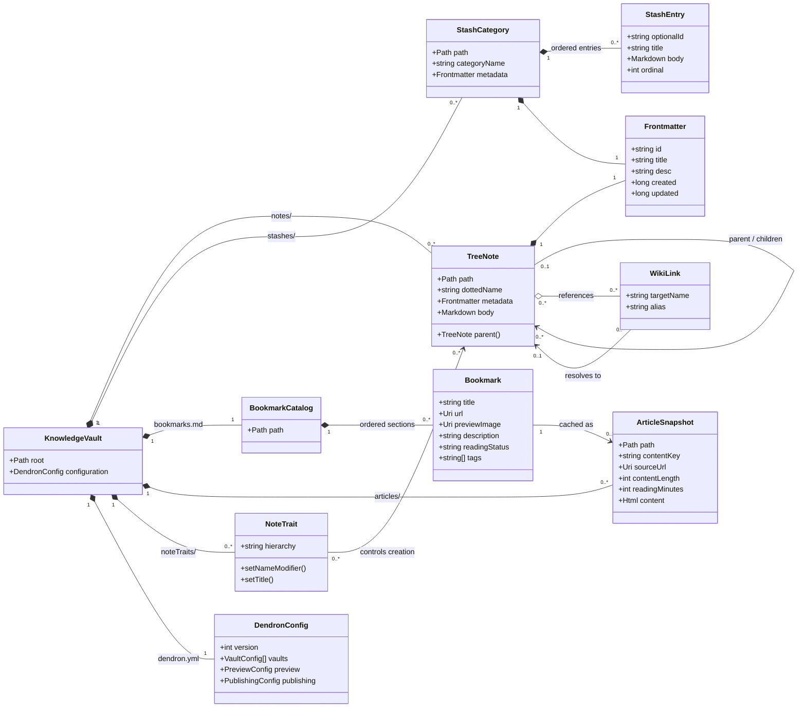

# Knowledge Management Directory Guide

This repository is a personal knowledge base with four main forms of content:

- **Tree notes** for structured, durable knowledge.
- **Stash notes** for several small notes grouped into category files.
- **Bookmarks** for saved web links and their metadata.
- **Articles** for local HTML snapshots of bookmarked pages.

## Directory map

```text
.
|-- notes/             Tree notes: one Markdown file per note
|-- stashes/           Stash notes: one Markdown file per category
|-- bookmarks.md       Bookmark catalog: one level-one section per bookmark
|-- articles/          Saved article content: one HTML file per bookmark
|-- noteTraits/        Dendron note-creation customizations
|-- small/             Secondary/compact copy of bookmark and article data
|-- dendron.yml        Dendron workspace and publishing configuration
`-- dendron.code-workspace
```

## Technical data model

The repository is a filesystem-backed document store. Paths provide collection
membership, Markdown structure provides record boundaries, and YAML or HTML
metadata provides typed attributes. There is no central database or manifest;
relationships must be reconstructed from filenames, links, and source URLs.



The UML composition relationships mirror ownership on disk. Deleting a stash
category deletes all entries because entries are not separate files. Deleting a
bookmark does not necessarily delete its article snapshot, so archive cleanup
must explicitly detect orphaned snapshots.

### Structural invariants

| Entity | Identity | Record boundary | Ordering |
| --- | --- | --- | --- |
| Tree note | Dotted filename and frontmatter `id` | Entire Markdown file | Not significant |
| Stash category | Category filename | Entire Markdown file | Not significant |
| Stash entry | Optional generated ID, otherwise position | Separator line | File order |
| Bookmark | Canonical URL | Level-one Markdown heading | File order |
| Article snapshot | URL-derived content key | Entire HTML file | Not significant |

These invariants are conventions rather than constraints enforced by the
filesystem. Tools that read the repository should validate them and report
collisions, broken links, malformed frontmatter, and orphaned articles.

## Tree notes

The `notes/` directory contains the primary structured knowledge. Each Markdown
file represents one note. Dots in the filename define its position in a logical
tree; the files themselves remain in one physical directory.

For example:

```text
Perso.md
Perso.Git.md
Perso.Git.rename-branches.md
```

This represents:

```text
Perso
`-- Git
    `-- rename-branches
```

The parent note may exist as its own file, but the hierarchy is encoded by the
name even when an intermediate parent file is absent. Preserve the established
capitalization of an existing branch when adding descendants.

The filename grammar is approximately:

```text
tree-note   = segment *("." segment) ".md"
parent-name = tree-note name with its final segment removed
segment     = one or more filename-safe characters
```

For `Perso.Git.rename-branches.md`, the dotted name is
`Perso.Git.rename-branches`, the direct parent is `Perso.Git`, and the root
hierarchy is `Perso`. Name comparison should be case-sensitive even on Windows,
because the same vault may be synchronized to a case-sensitive filesystem.

Tree notes use YAML frontmatter:

```markdown
---
id: Perso.Git.rename-branches
title: Perso.Git.rename-branches
desc: How to rename local and remote Git branches
updated: 1711635960434
created: 1705136341050
---

# How to rename branches

Note content goes here.
```

Common metadata fields are:

| Field | Purpose |
| --- | --- |
| `id` | Stable note identifier; often the dotted note name, but UUIDs also exist. |
| `title` | Display title. |
| `desc` | Short description of the note. |
| `created` | Creation timestamp, when managed by Dendron. |
| `updated` | Last-update timestamp, when managed by Dendron. |

Use Dendron to create or rename tree notes when practical so links, identifiers,
and timestamps remain consistent. Use wiki links such as
`[[Perso.Git.rename-branches]]` to connect related notes.

A reader should parse frontmatter only when the file begins with `---` and use
the next standalone `---` as the closing delimiter. The body is all remaining
Markdown. Additional metadata fields should be retained during updates even if
the reader does not understand them.

## Stash notes

The `stashes/` directory is organized by category, with one Markdown file per
category. Unlike tree notes, one stash file contains many independent notes.
Examples of categories include `Git`, `Cron`, `android`, and `personal notes`.

Separate entries with a line containing hyphens:

```markdown
---------

# Entry title

Entry content.

---------

# Another entry

More content.
```

Some existing stash files use a line of underscores (`__________`) and may add
generated entry identifiers such as `# 0:c266792f`. These are legacy variants
of the same entry boundary. Keep a file internally consistent; use `---------`
for new category files unless a consuming tool requires the legacy format.

A stash parser should:

1. Parse optional YAML frontmatter at the beginning of the category file.
2. Recognize a standalone run of at least five hyphens or underscores as an
  entry separator.
3. Preserve entry order and blank lines inside each entry.
4. Treat generated headings matching `# <ordinal>:<hex-id>` as entry metadata,
  not as the human-readable title.
5. Avoid splitting on horizontal rules inside fenced code blocks.

Use stash notes for short, loosely structured snippets that belong to a broad
category. Promote an entry to `notes/` when it needs its own hierarchy,
metadata, links, or ongoing maintenance.

## Bookmarks

`bookmarks.md` is the bookmark catalog. Every bookmark begins with a level-one
heading, so the next `#` heading marks the next record.

A bookmark can contain the URL, preview image, description, reading status, and
tags:

```markdown
# Page title

[https://example.com/article](https://example.com/article)


Short description of the page.

[ ] to read
[topic] [another topic]
```

Keep bookmark titles at heading level one. Use lower heading levels only inside
a bookmark record. The URL is the identity used to derive the corresponding
article filename.

For machine processing, a bookmark record starts at a line matching `^# ` and
ends immediately before the next matching line or end-of-file. The first HTTP(S)
link is the canonical URL. Images, descriptions, statuses, and tags are optional
fields. Parsing must be Markdown-aware so a `#` inside a fenced code block is
not interpreted as a new bookmark.

## Articles

The `articles/` directory contains extracted or archived HTML content for
bookmarks. There is normally one HTML file per bookmark, named from the bookmark
URL rather than the page title:

```text
articles/<base64url(sha256(bookmark-url))>.html
```

The naming procedure is:

1. Take the bookmark URL exactly as stored by the archiving process.
2. Encode it as bytes, normally UTF-8.
3. Compute its SHA-256 digest.
4. Encode the digest with URL-safe Base64.
5. Remove Base64 padding and append `.html`.

Equivalent pseudocode:

```python
from base64 import urlsafe_b64encode
from hashlib import sha256


def article_filename(bookmark_url: str) -> str:
  digest = sha256(bookmark_url.encode("utf-8")).digest()
  content_key = urlsafe_b64encode(digest).decode("ascii").rstrip("=")
  return f"{content_key}.html"
```

The URL input is byte-sensitive. Normalizing case, decoding `%xx` escapes,
removing a trailing slash, sorting query parameters, or converting `&amp;` to `&`
changes the digest. The producer and consumer must use the same canonical URL
representation. When reading a bookmark from Markdown, parse the link target
and decode Markdown/HTML escaping exactly once before hashing.

The resulting digest name is normally 43 characters before `.html`. URL-safe
Base64 uses `-` and `_` instead of `+` and `/`.

Some older article files have much longer names that are a URL-safe Base64
encoding of the URL itself rather than of its SHA-256 digest. Treat these as
legacy files; do not rename them without also updating the process or index that
locates article snapshots.

Saved HTML commonly records the original URL and extraction metadata in the
document head:

```html
<meta name="dendron:source-url" content="https://example.com/article">
<meta name="dendron:length" content="12345">
<meta name="dendron:time-to-read-minutes" content="10">
```

The HTML files are generated archive content. Prefer regenerating a snapshot
over manually editing it.

To verify a mapping, recompute the key from the bookmark URL and compare it with
the filename, then compare the URL with `meta[name="dendron:source-url"]`. A
digest match proves the filename input; the source metadata check detects stale
or incorrectly copied content.

## Integrity checks

A maintenance tool can validate the repository in this order:

1. Parse every tree note's YAML frontmatter and detect duplicate `id` values.
2. Derive each tree note's parent and report missing parents as stubs or
  warnings, according to the Dendron configuration.
3. Resolve wiki-link targets and report missing or case-mismatched notes.
4. Parse stash boundaries and detect duplicate generated entry IDs.
5. Parse bookmark records and detect missing or duplicate canonical URLs.
6. Recompute each expected article content key and check that the HTML exists.
7. Read each snapshot's `dendron:source-url` and detect mismatches or orphans.
8. Reject unresolved Git conflict markers before publishing or transforming
  content.

Writes that affect multiple artifacts should be atomic from the user's point of
view. For example, archiving a bookmark should write the HTML snapshot to a
temporary file, rename it to its final digest name, and only then update the
bookmark catalog. This prevents a catalog entry from pointing to a partial
snapshot.

## Supporting files

- `dendron.yml` configures the self-contained Dendron vault, note behavior,
  preview, publishing, journals, tasks, and link handling.
- `noteTraits/` contains JavaScript hooks that customize Dendron note creation.
  For example, the `Perso` trait prefixes new note names with `Perso.`.
- `small/` contains another bookmark catalog and article collection. Its content
  overlaps the root bookmark archive, so establish whether it is generated or a
  deployment subset before changing it directly.

## Choosing where content belongs

| Content | Location |
| --- | --- |
| Durable topic with its own identity or hierarchy | `notes/<dotted-name>.md` |
| Small snippet grouped with similar snippets | `stashes/<category>.md` |
| Link to revisit, classify, or read later | `bookmarks.md` |
| Offline content captured from a bookmark | `articles/<digest>.html` |

## Maintenance guidelines

1. Preserve dotted filenames when moving within the tree; a rename changes the
   note's logical parent and may require link updates.
2. Keep YAML frontmatter valid and at the beginning of each tree note.
3. Add each bookmark as a new level-one section and retain its canonical URL.
4. Derive article filenames deterministically from the same URL representation.
5. Do not hand-edit generated article HTML unless regeneration is impossible.
6. Resolve Git conflict markers (`<<<<<<<`, `|||||||`, `=======`, `>>>>>>>`)
   before editing affected knowledge entries; markers currently exist in some
   notes, stashes, and the root bookmark catalog.