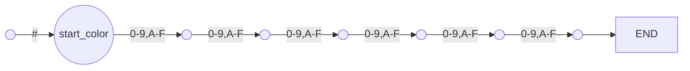

[issue #8](https://github.com/b3b00/cslycli/issues/8)

# quick example

```
# hexa color 

[Extension]
HEXA_COLOR 
>>>
-> # @start_color -> [0-9,A-F] {6} -> END
<<<
```
produces :



# general structure

arrow pattern node_name?


## naming nodes

leading @ (node name must be an identifier)

```
@node_name
```

## patterns

### single character

```
-> C 
```

### range

between square bracket. start and end are separated by - (dash). Many range may be specified separated by ; (semicolon)

```
-> [a-z,A-Z,0-9] 
```
, pas ; comme il s'agit du marqueur de fin de ligne.

### exclusion

```
-> ^ pattern
```

non pas de récursion car cela poserait problème pour ```^^a``` par exemple. 


### repetition

#### one or more

```
-> pattern+
```

#### zero or more

```
-> pattern*
```

#### any ?
```
-> . ->
```

#### count

```
-> pattern {n}
```


### ending 

```
-> *END*
```


# grammar

```
pattern : STRING repeater?
pattern : LEFTBRACKET[d] range (COMMA[d] range)* RBRACK[d]
# pattern : NOT PATTERN ⚠️ 
range : CHAR DASH CHAR
repeater : STAR | PLUS | LEFTCURL RIGHTCURL
```