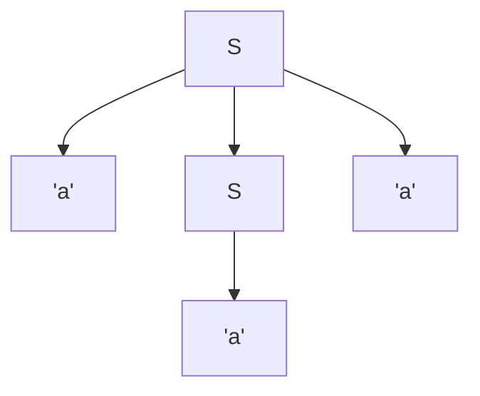
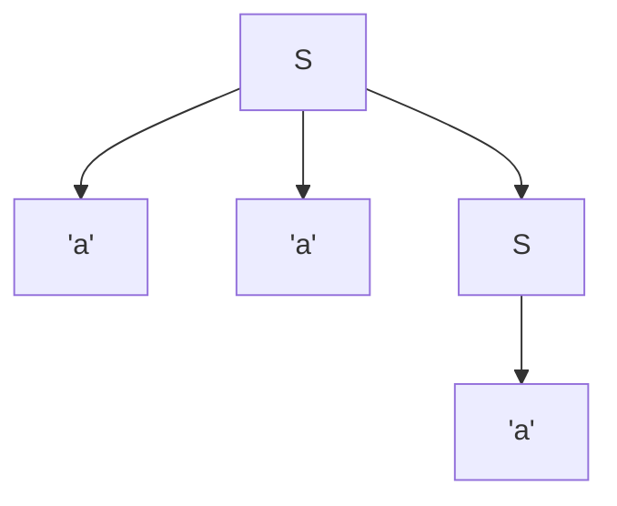

# simple ambiguous grammar.

## grammar
```
S> ::= 'a' <S> 'a' | 'a' 'a' <S> | 'a'
```
**What it generates**

Language: { a^n b | n ≥ 1 } — e.g., ab, aab, aaab, …


##derivations

### first 

Derivation 1 (using <S> → 'a' <S> 'a' then <S> → 'a'):
```` 
<S>
⇒ 'a' <S> 'a'
⇒ 'a' 'a' 'a'
```
### second

Derivation 2 (using <S> → 'a' 'a' <S> then <S> → 'a'):

```
<S>
⇒ 'a' 'a' <S>
⇒ 'a' 'a' 'a'
```


## trees

### first

```
      S
   /  |  \
 'a'  S  'a'
      |
     'a'
```



### second

```
      S
   /   \    \
 'a'  'a'    S
             |
            'a'
```



