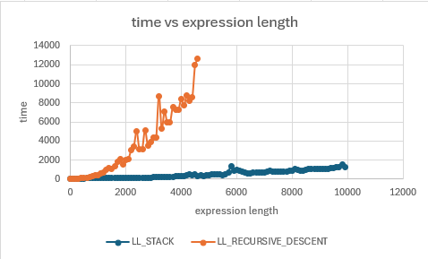

# [696accdc45ae2e95abb13b8145a8bee6ead43f0c](https://github.com/b3b00/csly/commit/696accdc45ae2e95abb13b8145a8bee6ead43f0c) 06/05/2025

First bench was on 06/05/2025 [696accdc45ae2e95abb13b8145a8bee6ead43f0c] (https://github.com/b3b00/csly/commit/696accdc45ae2e95abb13b8145a8bee6ead43f0c)

| Method    | Mean      | Error     | StdDev    | Ratio         | RatioSD | Gen0       | Gen1       | Gen2       | Allocated | Alloc Ratio |
|---------- |----------:|----------:|----------:|--------------:|--------:|-----------:|-----------:|-----------:|----------:|------------:|
| recursive | 487.05 ms | 14.350 ms | 39.764 ms |      baseline |         | 86000.0000 | 34000.0000 | 20000.0000 | 461.95 MB |             |
| stacked   |  22.54 ms |  0.558 ms |  1.584 ms | 21.71x faster |   2.23x | 16562.5000 |   625.0000 |   156.2500 |  67.72 MB |  6.82x less |

repeated on the 07/05/2025 on same commit

| Method               | parserType           | Mean      | Error     | StdDev    | Median    | Gen0       | Gen1       | Gen2       | Allocated |
|--------------------- |--------------------- |----------:|----------:|----------:|----------:|-----------:|-----------:|-----------:|----------:|
| BenchLargeExpression | LL_RECURSIVE_DESCENT | 495.36 ms | 15.034 ms | 43.615 ms | 488.80 ms | 89000.0000 | 34000.0000 | 22000.0000 | 478.65 MB |
| BenchLargeExpression | LL_STACK             |  22.45 ms |  1.027 ms |  2.980 ms |  21.33 ms | 16562.5000 |   968.7500 |          - |  67.54 MB |

# [49d00e000827ae6414633cd9ffc45ffd0376b6cb](https://github.com/b3b00/csly/commit/49d00e000827ae6414633cd9ffc45ffd0376b6cb) 07/05/2025

| Method    | Mean      | Error     | StdDev    | Ratio        | RatioSD | Gen0       | Gen1       | Gen2       | Allocated | Alloc Ratio |
|---------- |----------:|----------:|----------:|-------------:|--------:|-----------:|-----------:|-----------:|----------:|------------:|
| recursive | 480.21 ms | 17.167 ms | 48.138 ms |     baseline |         | 87000.0000 | 35000.0000 | 21000.0000 |  468.5 MB |             |
| stacked   |  75.74 ms |  2.704 ms |  7.714 ms | 6.41x faster |   0.96x | 30428.5714 |   857.1429 |   428.5714 | 127.73 MB |  3.67x less |

Something's strange ! how does CPU usage and memory allocation could have so drastically  degraded ?
 
diffs are : 
[696accdc45ae2e95abb13b8145a8bee6ead43f0c..49d00e000827ae6414633cd9ffc45ffd0376b6cb](https://github.com/b3b00/csly/compare/696accdc45ae2e95abb13b8145a8bee6ead43f0c..49d00e000827ae6414633cd9ffc45ffd0376b6cb)

It seems to be related to [b1d923cdd9fa9289df70dc20f439f067be566485](https://github.com/b3b00/csly/commit/b1d923cdd9fa9289df70dc20f439f067be566485)

when undoing this we get these results :

| Method    | Mean      | Error     | StdDev     | Median    | Ratio         | RatioSD | Gen0       | Gen1       | Gen2       | Allocated | Alloc Ratio |
|---------- |----------:|----------:|-----------:|----------:|--------------:|--------:|-----------:|-----------:|-----------:|----------:|------------:|
| recursive | 823.66 ms | 67.483 ms | 198.975 ms | 878.18 ms |      baseline |         | 87000.0000 | 31000.0000 | 22000.0000 | 472.26 MB |             |
| stacked   |  21.52 ms |  1.321 ms |   3.854 ms |  20.54 ms | 38.98x faster |  10.53x | 16400.0000 |   600.0000 |    66.6667 |  67.05 MB |  7.04x less |

# [373adb4cf423a3d577a440025ab9aa503a4ce5bd](https://github.com/b3b00/csly/commit/373adb4cf423a3d577a440025ab9aa503a4ce5bd) - 09/05/2025

| Method    | Mean      | Error     | StdDev    | Ratio        | RatioSD | Gen0       | Gen1       | Gen2       | Allocated | Alloc Ratio |
|---------- |----------:|----------:|----------:|-------------:|--------:|-----------:|-----------:|-----------:|----------:|------------:|
| recursive | 415.60 ms | 11.442 ms | 32.645 ms |     baseline |         | 86000.0000 | 35000.0000 | 21000.0000 | 463.82 MB |             |
| stacked   |  61.55 ms |  1.228 ms |  2.306 ms | 6.63x faster |   0.46x | 28666.6667 |   333.3333 |          - | 122.26 MB |  3.79x less |

**Unit tests ok are better than awesome but irealistic perfs.**
Keep on this way.

# EBNF : after profiling and using a managed stack

| Method    | Mean     | Error    | StdDev   | Ratio        | RatioSD | Gen0       | Gen1      | Gen2     | Allocated | Alloc Ratio |
|---------- |---------:|---------:|---------:|-------------:|--------:|-----------:|----------:|---------:|----------:|------------:|
| recursive | 37.09 ms | 1.486 ms | 4.358 ms |     baseline |         | 18500.0000 |  500.0000 | 166.6667 |  79.61 MB |             |
| stacked   | 29.33 ms | 0.453 ms | 0.402 ms | 1.45x faster |   0.14x | 18666.6667 | 1000.0000 | 333.3333 |  79.88 MB |  1.00x more |
