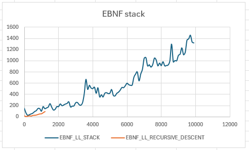

Benchmark for EBNF is using [SimpleExpressionParser](https://github.com/b3b00/csly/blob/dev/src/samples/SimpleExpressionParser/SimpleExpressionParser.cs) with a 1000 operands expression.

# [6682c1aae823f3217c58ebfe3c071cf6203a16e1](https://github.com/b3b00/csly/commit/6682c1aae823f3217c58ebfe3c071cf6203a16e1) 01/06/2025

After removing call to IsInstanceOf (```x is Y```) and replace them by a Enum.
Still 3 failing unit tests though.

| Method    | Mean     | Error    | StdDev   | Ratio        | RatioSD | Gen0       | Gen1      | Gen2     | Allocated | Alloc Ratio |
|---------- |---------:|---------:|---------:|-------------:|--------:|-----------:|----------:|---------:|----------:|------------:|
| recursive | 37.09 ms | 1.486 ms | 4.358 ms |     baseline |         | 18500.0000 |  500.0000 | 166.6667 |  79.61 MB |             |
| stacked   | 29.33 ms | 0.453 ms | 0.402 ms | 1.45x faster |   0.14x | 18666.6667 | 1000.0000 | 333.3333 |  79.88 MB |  1.00x more |

| Method    | Mean     | Error    | StdDev    | Ratio        | RatioSD | Gen0       | Gen1      | Gen2     | Allocated | Alloc Ratio |
|---------- |---------:|---------:|----------:|-------------:|--------:|-----------:|----------:|---------:|----------:|------------:|
| recursive | 68.16 ms | 3.175 ms |  9.312 ms |     baseline |         | 18333.3333 | 1000.0000 | 333.3333 |   79.4 MB |             |
| stacked   | 54.77 ms | 3.858 ms | 11.376 ms | 1.28x faster |   0.22x | 18800.0000 |  800.0000 | 200.0000 |  80.57 MB |  1.01x more |

# [9457c17b0c8ba5f0345bd497b351ce2749abf8ea](https://github.com/b3b00/csly/commit/9457c17b0c8ba5f0345bd497b351ce2749abf8ea)

```
BenchmarkDotNet v0.13.12, Windows 11 (10.0.22631.5472/23H2/2023Update/SunValley3)
Intel Core i7-10610U CPU 1.80GHz, 1 CPU, 8 logical and 4 physical cores
.NET SDK 9.0.300
  [Host]     : .NET 8.0.16 (8.0.1625.21506), X64 RyuJIT AVX2
  DefaultJob : .NET 8.0.16 (8.0.1625.21506), X64 RyuJIT AVX2
```


| Method    | Mean     | Error    | StdDev    | Median   | Ratio        | RatioSD | Gen0       | Gen1      | Gen2     | Allocated | Alloc Ratio |
|---------- |---------:|---------:|----------:|---------:|-------------:|--------:|-----------:|----------:|---------:|----------:|------------:|
| recursive | 53.18 ms | 5.943 ms | 17.522 ms | 45.83 ms |     baseline |         | 18400.0000 | 1200.0000 | 200.0000 |  79.04 MB |             |
| stacked   | 35.77 ms | 0.989 ms |  2.789 ms | 35.20 ms | 1.46x faster |   0.49x | 18857.1429 | 1000.0000 | 428.5714 |  80.41 MB |  1.02x more |

EBNF recursive parser stops after 1200 operands.




