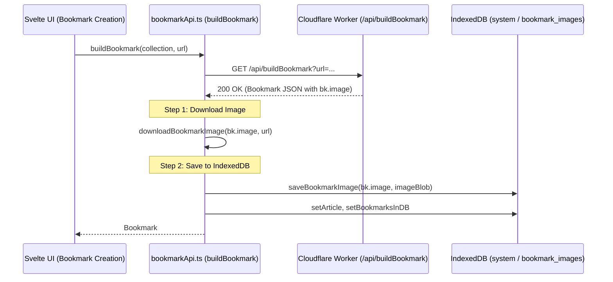
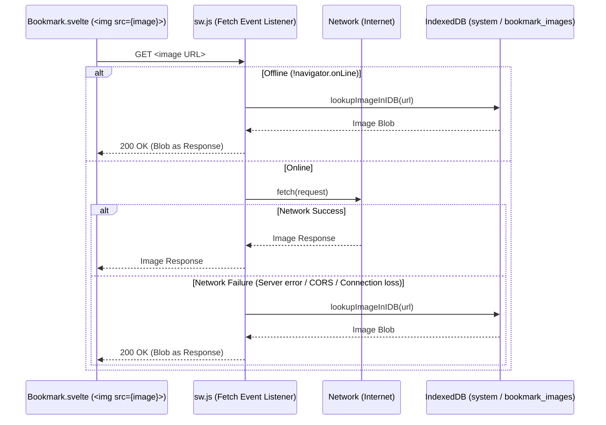

# Walkthrough - Offline Bookmark Header Images (Steps 1, 2 & 3)

## Overview

When offline, bookmark header images previously degraded to generic SVG placeholders. To allow bookmark cards to retain their real header images offline without changing card markup or URLs, the application downloads and caches the images at bookmark creation time into IndexedDB and intercepts requests via the Service Worker when offline.

This document describes the end-to-end implementation across all three steps:
1. **Step 1**: Downloading the image upon bookmark build (getting image link from backend payload).
2. **Step 2**: Saving the image binary blob to IndexedDB in the `bookmark_images` store.
3. **Step 3**: Intercepting image requests via the Service Worker when offline and serving the blobs from IndexedDB.

---

## Architectural Workflows

### 1. Creation & Caching Flow (Online - Steps 1 & 2)



### 2. Rendering & Serving Flow (Offline - Step 3)



---

## Step 1: Image Download on Bookmark Creation

### 1. Extraction from Backend Payload
When `buildBookmark(collection, url, ...)` in `wwwroot/scripts/bookmarkApi.ts` calls `/api/buildBookmark?url=${url}`, the backend extracts metadata (Open Graph tags `og:image`, `image`, or an SVG fallback data URI) and returns a `Bookmark` object containing `bk.image`.

### 2. Download Helpers (`downloadBookmarkImage` & `dataUriToBlob`)
In `wwwroot/scripts/bookmarkApi.ts`:
- **`dataUriToBlob(dataUri: string): Blob | null`**:
  Parses base64 or URL-encoded `data:` URIs (such as SVG placeholder data URIs generated when pages lack Open Graph images) into binary `Blob` objects without requiring network access.
- **`downloadBookmarkImage(imageUrl: string, baseUrl?: string): Promise<Blob | null>`**:
  - Validates and handles data URIs directly using `dataUriToBlob`.
  - Resolves relative image URLs against the bookmark's source URL (`baseUrl`) if necessary.
  - Fetches the image over HTTP/HTTPS and extracts the response `Blob`.
  - Gracefully catches network errors or HTTP error responses (logging warnings) to ensure bookmark creation never fails due to an image download issue.

---

## Step 2: Saving Images to IndexedDB

### 1. Store Definition
In `wwwroot/scripts/constants.ts`:
- Defined `export const BOOKMARK_IMAGES = 'bookmark_images';`.
- Added `BOOKMARK_IMAGES` to `SYSTEM_STORES`:
  ```ts
  export const SYSTEM_STORES = [SYSTEM_COLLECTIONS, SYSTEM_FAVORITE_COLLECTION, BOOKMARK_IMAGES];
  ```
- Because header images are intercepted by image URLs (regardless of which collection is active), they are stored globally in the `system` database (`SYSTEM_DB_NAME`).

### 2. Database Upgrades & CRUD Methods
In `wwwroot/scripts/database.ts`:
- **`createSystem()`**:
  Ensures `initDatabase(SYSTEM_DB_NAME, SYSTEM_STORES)` runs and automatically detects any missing stores (such as newly added `bookmark_images`) on existing databases, upgrading the Dexie/IndexedDB schema seamlessly.
- **`saveBookmarkImage(imageUrl: string, blob: Blob): Promise<void>`**:
  Stores the binary image `Blob` in `system.bookmark_images` using `imageUrl` as the out-of-line key.
- **`getBookmarkImage(imageUrl: string): Promise<Blob | null>`**:
  Retrieves the stored `Blob` for a given image URL.
- **`removeBookmarkImage(imageUrl: string): Promise<void>`**:
  Deletes the image record from `system.bookmark_images`.

### 3. Pipeline Integration
In `wwwroot/scripts/bookmarkApi.ts`:
- Inside `buildBookmark()`, right after receiving the backend response:
  ```ts
  if (bk.image) {
    try {
      const imageBlob = await downloadBookmarkImage(bk.image, url);
      if (imageBlob) {
        await saveBookmarkImage(bk.image, imageBlob);
        if (!bk.image.startsWith('data:') && !bk.image.startsWith('http://') && !bk.image.startsWith('https://')) {
          try {
            const resolvedUrl = new URL(bk.image, url).href;
            if (resolvedUrl !== bk.image) {
              await saveBookmarkImage(resolvedUrl, imageBlob);
            }
          } catch {}
        }
      }
    } catch (err) {
      console.warn(`failed to download or save bookmark image for ${url}:`, err);
    }
  }
  ```

---

## Step 3: Offline Service Worker Interception & Serving

### 1. Bookmark Card Image Retained Offline
In `wwwroot/components/bookmarks/Bookmark.svelte`:
- Previously, when `!navigator.onLine`, `image` was forced to an empty string, immediately falling back to generic SVG placeholders.
- Updated line 33 to preserve `local.image`:
  ```ts
  image = await getImage(local.image || "", local.link);
  ```
- Retaining `local.image` ensures that `` requests the real image URL even when offline, allowing the Service Worker to intercept it.
- Added an `on:error` fallback handler on `` to gracefully switch to the placeholder only if the image is neither online nor in the offline cache.

### 2. Service Worker Image Cache Interception
In `wwwroot/sw.template.js`:
- Added IndexedDB helpers:
  - `lookupImageInIDB(imageUrl)`: Opens the `system` IndexedDB, checks for the `bookmark_images` store, and retrieves the stored blob for `imageUrl`.
  - `getBookmarkImageFromIDB(imageUrl)`: Retrieves the image blob by URL with automatic URL decoding fallback.
  - `createBlobResponse(blob)`: Wraps the retrieved `Blob` in a standard HTTP 200 `Response` with `Content-Type: blob.type`, `Content-Length`, and cache headers.
- Integrated into `self.addEventListener('fetch', event => { ... })`:
  - **Static assets**: When offline (`!navigator.onLine`) or when network fetch fails in `.catch()`, queries `getBookmarkImageFromIDB(event.request.url)` and serves the blob response.
  - **Dynamic / extensionless image endpoints**: Identified by `event.request.destination === 'image'`. If offline or if network fetch rejects, falls back to IndexedDB and returns the cached blob response.

---

## Verification & Tests

### Automated Unit Tests
1. **`wwwroot/tests/bookmarkApi.test.ts`**:
   - `dataUriToBlob`: verifies conversion of base64 and URL-encoded data URIs to valid `Blob` instances.
   - `downloadBookmarkImage`: tests empty URLs, data URIs, successful remote fetches, relative URL resolution, 404 responses, and network exceptions.
   - `buildBookmark`: verifies that `downloadBookmarkImage` and `saveBookmarkImage` are invoked with the backend payload image URL and blob, and verifies resilience against download failures.

2. **`wwwroot/tests/databaseImages.test.ts`**:
   - `saveBookmarkImage`: validates that the binary blob is stored in `system` DB under `bookmark_images`.
   - `getBookmarkImage`: validates blob retrieval by URL key.
   - `removeBookmarkImage`: validates deletion of cached image entries.

3. **`wwwroot/tests/serviceWorkerImages.test.ts`**:
   - `lookupImageInIDB`: validates store existence checking and blob retrieval from IndexedDB.
   - `getBookmarkImageFromIDB`: validates URL-encoded fallback matching.
   - `createBlobResponse`: validates construction of an HTTP 200 Response with correct MIME type and Content-Length.
   - Simulated offline fetch fallback: verifies that when offline, image requests intercept and return cached blob content.

All test suites pass:
```bash
npm test
# Result: 4 passed, 4 total (29 passed)
```

Build verification:
```bash
npm run build
# Result: build:back and build:front succeeded with exit code 0
```